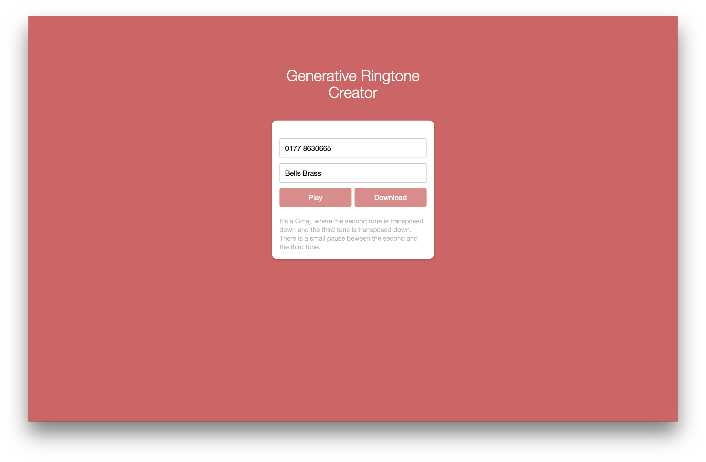

# Personal Ringtone Generator

This is an experiment in **generative audio design** created by [Christoph Labacher](http://www.christophlabacher.com). It’s micro-project coded in a day.

Different digits of the phone number are used to create a chord, which can be played with various instruments. The idea is that in a messaging app close friends could get a personal ringtone which would become recognizable over time – so you already know who wrote a message. The ringtones are still supposed to sound consistent, though. The different instruments could be used to symbolize different groups.

The sounds were created by the [University of Iowa Electronic Music Studios](http://theremin.music.uiowa.edu/index.html).

## How many combinations are there?
Seven digits of the phone number are used to create the chord. There are however significantly less than 9,999,999 possible combinations: Every digit except for the first one is altering between two or three states instead of nine. Because of this there are 1440 different chords.

Then again, who has 9,999,999 contacts?

## Which properties of the chords are altered?

The phone number is flipped around, then every second digit is taken into consideration. Each one alters the chord according to the following table:

|  | Scale | Key | Seven | Second Tone | Third Tone | First Pause | Second Pause |
| ------ | ------ | ------ | ------ | ------ | ------ | ------ | ------ |
| 0 | C | man | yes | Down | Up | 0 | 1 |
| 1 | D | min | yes | - | - | 1 | 0 |
| 2 | Eb | maj | no | Up | Down | 0 | 1 |
| 3 | E | min | no | Down | Up | 1 | 0 |
| 4 | F | maj | yes | - | - | 0 | 1 |
| 5 | G | min | yes | Up | Down | 1 | 0 |
| 6 | Ab | maj | no | Down | Up | 0 | 1 |
| 7 | A | min | no | - | - | 1 | 0 |
| 8 | Bb | maj | yes | Up | Down | 0 | 1 |
| 9 | B | min | yes | Down | Up | 1 | 0 |

## Will the same phone number always produce the same result?
Yes. There is no randomness involved – that’s kind of the point.